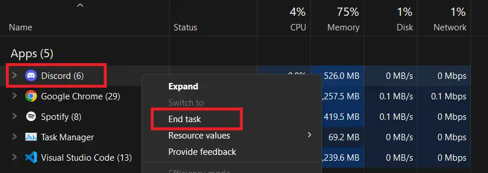

# 🎮 Auto Claim Discord Quests (Without Playing)

> 🇮🇩 Looking for the Indonesian version? [Click here](./README-ID.md)

## ⚠️ WARNING

This method is **not recommended for your main account**. Modifying the Discord client may violate [Discord's Terms of Service](https://discord.com/terms). Use at your own risk.

---

## 🧩 Step 1: Enable Developer Mode in Discord

### Windows

1. **Close Discord completely** (Right-click in taskbar > Quit).



2. Press `Windows + R`, type: `%appdata%\discord`


3. Backup the `settings.json` file → Rename it to `settings_old.json`


4. Replace the content of `settings.json` with:

#### Settings Code

```json
{
  "IS_MAXIMIZED": true,
  "IS_MINIMIZED": false,
  "WINDOW_BOUNDS": {
    "x": 112,
    "y": 60,
    "width": 1284,
    "height": 724
  },
  "DANGEROUS_ENABLE_DEVTOOLS_ONLY_ENABLE_IF_YOU_KNOW_WHAT_YOURE_DOING": true,
  "MIN_WIDTH": 940,
  "MIN_HEIGHT": 500,
  "chromiumSwitches": {}
}
```

### macOS

> ⚠️ Note: I don't have a Mac device, so there's no screenshot for this section.  
> However, you can still follow the steps below carefully — they are written clearly.

1. Quit Discord.

2. Open Finder > Go > "Go to Folder" (`Shift + Cmd + G`)

3. Enter: `~/Library/Application Support/discord`

4. Backup and rename `settings.json` → `settings_old.json`

5. Replace content `settings.json` [as shown above](#settings-code).

---

## 🧪 Step 2: Complete Quest Without Playing

1. Open Discord, go to the **Quests tab**, and **accept any quest**.

2. Make sure to select **"Quest on Desktop"**, not console.


3. Open Developer Tools in the **installed Discord desktop app** (not Discord Web):

   - Windows: `Ctrl + Shift + I`

   - macOS: `Cmd + Option + I`

   > ⚠️ Make sure you're using the Discord desktop app. This will **not work** on the web version.

   

4. Go to **Console** tab and enable `Verbose`.


5. Paste the following [code](./script.js):

```js
delete window.$;
let wpRequire = webpackChunkdiscord_app.push([[Symbol()], {}, (r) => r]);
webpackChunkdiscord_app.pop();

let ApplicationStreamingStore = Object.values(wpRequire.c).find(
  (x) => x?.exports?.Z?.__proto__?.getStreamerActiveStreamMetadata
)?.exports?.Z;
let RunningGameStore = Object.values(wpRequire.c).find(
  (x) => x?.exports?.ZP?.getRunningGames
)?.exports?.ZP;
let QuestsStore = Object.values(wpRequire.c).find(
  (x) => x?.exports?.Z?.__proto__?.getQuest
)?.exports?.Z;
let ChannelStore = Object.values(wpRequire.c).find(
  (x) => x?.exports?.Z?.__proto__?.getAllThreadsForParent
)?.exports?.Z;
let GuildChannelStore = Object.values(wpRequire.c).find(
  (x) => x?.exports?.ZP?.getSFWDefaultChannel
)?.exports?.ZP;
let FluxDispatcher = Object.values(wpRequire.c).find(
  (x) => x?.exports?.Z?.__proto__?.flushWaitQueue
)?.exports?.Z;
let api = Object.values(wpRequire.c).find((x) => x?.exports?.tn?.get)?.exports
  ?.tn;

let quest = [...QuestsStore.quests.values()].find(
  (x) =>
    x.id !== "1248385850622869556" &&
    x.userStatus?.enrolledAt &&
    !x.userStatus?.completedAt &&
    new Date(x.config.expiresAt).getTime() > Date.now()
);

let isApp = typeof DiscordNative !== "undefined";

if (!quest) {
  console.log("You don't have any uncompleted quests!");
} else {
  const pid = Math.floor(Math.random() * 30000) + 1000;
  const applicationId = quest.config.application?.id;
  const applicationName = quest.config.application?.name;

  const taskConfig = quest.config.taskConfig ?? quest.config.taskConfigV2;
  const tasks = taskConfig?.tasks;

  if (!tasks) {
    console.log(
      "Quest ini tidak punya taskConfig.tasks. Struktur quest mungkin berbeda atau sudah berubah."
    );
  } else {
    const taskName = [
      "WATCH_VIDEO",
      "PLAY_ON_DESKTOP",
      "STREAM_ON_DESKTOP",
      "PLAY_ACTIVITY",
    ].find((x) => tasks[x] != null);

    if (!taskName) {
      console.log("Tidak menemukan task yang cocok di quest ini!");
    } else {
      const secondsNeeded = tasks[taskName].target;
      let secondsDone = quest.userStatus?.progress?.[taskName]?.value ?? 0;

      console.log(
        `Quest ditemukan: ${applicationName}, task: ${taskName}, target: ${secondsNeeded} detik`
      );

      if (taskName === "WATCH_VIDEO") {
        const maxFuture = 10,
          speed = 7,
          interval = 1;
        const enrolledAt = new Date(quest.userStatus.enrolledAt).getTime();
        let fn = async () => {
          while (true) {
            const maxAllowed =
              Math.floor((Date.now() - enrolledAt) / 1000) + maxFuture;
            const diff = maxAllowed - secondsDone;
            const timestamp = secondsDone + speed;

            if (diff >= speed) {
              await api.post({
                url: `/quests/${quest.id}/video-progress`,
                body: {
                  timestamp: Math.min(secondsNeeded, timestamp + Math.random()),
                },
              });
              secondsDone = Math.min(secondsNeeded, timestamp);
              console.log(`Update progress: ${secondsDone}/${secondsNeeded}`);
            }

            if (timestamp >= secondsNeeded) {
              break;
            }
            await new Promise((resolve) =>
              setTimeout(resolve, interval * 1000)
            );
          }
          console.log("Quest completed!");
        };
        fn();
        console.log(`Spoofing video for ${applicationName}.`);
      } else if (taskName === "PLAY_ON_DESKTOP") {
        if (!isApp) {
          console.log(
            "This no longer works in browser for non-video quests. Use the desktop app to complete the",
            applicationName,
            "quest!"
          );
        } else {
          api
            .get({
              url: `/applications/public?application_ids=${applicationId}`,
            })
            .then((res) => {
              const appData = res.body[0];
              const exeName = appData.executables
                .find((x) => x.os === "win32")
                .name.replace(">", "");

              const fakeGame = {
                cmdLine: `C:\\Program Files\\${appData.name}\\${exeName}`,
                exeName,
                exePath: `c:/program files/${appData.name.toLowerCase()}/${exeName}`,
                hidden: false,
                isLauncher: false,
                id: applicationId,
                name: appData.name,
                pid: pid,
                pidPath: [pid],
                processName: appData.name,
                start: Date.now(),
              };
              const realGames = RunningGameStore.getRunningGames();
              const realGetRunningGames = RunningGameStore.getRunningGames;
              const realGetGameForPID = RunningGameStore.getGameForPID;

              RunningGameStore.getRunningGames = () => [fakeGame];
              RunningGameStore.getGameForPID = (pid) => fakeGame;
              FluxDispatcher.dispatch({
                type: "RUNNING_GAMES_CHANGE",
                removed: realGames,
                added: [fakeGame],
                games: [fakeGame],
              });

              let fn = (data) => {
                let progress =
                  quest.config.configVersion === 1
                    ? data.userStatus.streamProgressSeconds
                    : Math.floor(
                        data.userStatus.progress.PLAY_ON_DESKTOP.value
                      );
                console.log(`Quest progress: ${progress}/${secondsNeeded}`);

                if (progress >= secondsNeeded) {
                  console.log("Quest completed!");
                  RunningGameStore.getRunningGames = realGetRunningGames;
                  RunningGameStore.getGameForPID = realGetGameForPID;
                  FluxDispatcher.dispatch({
                    type: "RUNNING_GAMES_CHANGE",
                    removed: [fakeGame],
                    added: [],
                    games: [],
                  });
                  FluxDispatcher.unsubscribe(
                    "QUESTS_SEND_HEARTBEAT_SUCCESS",
                    fn
                  );
                }
              };
              FluxDispatcher.subscribe("QUESTS_SEND_HEARTBEAT_SUCCESS", fn);
              console.log(
                `Spoofed your game to ${applicationName}. Wait for ${Math.ceil(
                  (secondsNeeded - secondsDone) / 60
                )} more minutes.`
              );
            });
        }
      } else if (taskName === "STREAM_ON_DESKTOP") {
        if (!isApp) {
          console.log(
            "This no longer works in browser for non-video quests. Use the desktop app to complete the",
            applicationName,
            "quest!"
          );
        } else {
          let realFunc =
            ApplicationStreamingStore.getStreamerActiveStreamMetadata;
          ApplicationStreamingStore.getStreamerActiveStreamMetadata = () => ({
            id: applicationId,
            pid,
            sourceName: null,
          });

          let fn = (data) => {
            let progress =
              quest.config.configVersion === 1
                ? data.userStatus.streamProgressSeconds
                : Math.floor(data.userStatus.progress.STREAM_ON_DESKTOP.value);
            console.log(`Quest progress: ${progress}/${secondsNeeded}`);
            if (progress >= secondsNeeded) {
              console.log("Quest completed!");
              ApplicationStreamingStore.getStreamerActiveStreamMetadata =
                realFunc;
              FluxDispatcher.unsubscribe("QUESTS_SEND_HEARTBEAT_SUCCESS", fn);
            }
          };
          FluxDispatcher.subscribe("QUESTS_SEND_HEARTBEAT_SUCCESS", fn);
          console.log(
            `Spoofed your stream to ${applicationName}. Stream any window in vc for ${Math.ceil(
              (secondsNeeded - secondsDone) / 60
            )} more minutes.`
          );
          console.log(
            "Remember that you need at least 1 other person to be in the vc!"
          );
        }
      } else if (taskName === "PLAY_ACTIVITY") {
        const channelId =
          ChannelStore.getSortedPrivateChannels()[0]?.id ??
          Object.values(GuildChannelStore.getAllGuilds()).find(
            (x) => x != null && x.VOCAL.length > 0
          )?.VOCAL[0].channel.id;
        const streamKey = `call:${channelId}:1`;

        let fn = async () => {
          console.log(
            "Completing quest",
            applicationName,
            "-",
            quest.config.messages.questName
          );
          while (true) {
            const res = await api.post({
              url: `/quests/${quest.id}/heartbeat`,
              body: { stream_key: streamKey, terminal: false },
            });
            const progress = res.body.progress.PLAY_ACTIVITY.value;
            console.log(`Quest progress: ${progress}/${secondsNeeded}`);
            await new Promise((resolve) => setTimeout(resolve, 20 * 1000));
            if (progress >= secondsNeeded) {
              await api.post({
                url: `/quests/${quest.id}/heartbeat`,
                body: { stream_key: streamKey, terminal: true },
              });
              break;
            }
          }
          console.log("Quest completed!");
        };
        fn();
      }
    }
  }
}
```

5. Let it sit for the quest time (e.g., **900 seconds**).


6. Click **Claim Reward** once available.


---

## 📜 Disclaimer

> This repository is for educational purposes only. The author is not responsible for any bans, data loss, or other consequences that may occur from using this method.
