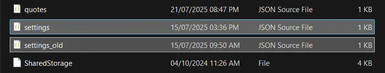
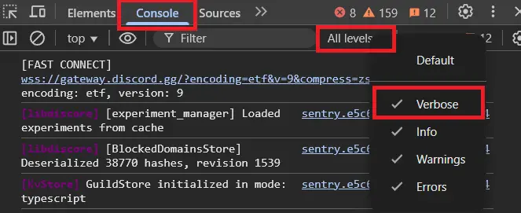
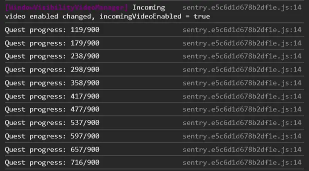
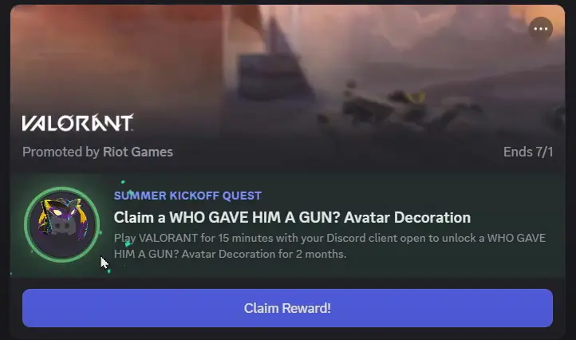

# 🎮 Auto Claim Discord Quests (Without Playing)

> 🇮🇩 Looking for the Indonesian version? [Click here](./README-ID.md)

## ⚠️ WARNING

This method is **not recommended for your main account**. Modifying the Discord client may violate [Discord's Terms of Service](https://discord.com/terms). Use at your own risk.

---

## 🧩 Step 1: Enable Developer Mode in Discord

### Windows

1. **Close Discord completely** (Right-click in taskbar > Quit).


2. Press `Windows + R`, type: `%appdata%\discord`


3. Backup the `settings.json` file → Rename it to `settings_old.json`



4. Replace the content of `settings.json` with:

#### Settings Code

```json
{
  "IS_MAXIMIZED": true,
  "IS_MINIMIZED": false,
  "WINDOW_BOUNDS": {
    "x": 112,
    "y": 60,
    "width": 1284,
    "height": 724
  },
  "DANGEROUS_ENABLE_DEVTOOLS_ONLY_ENABLE_IF_YOU_KNOW_WHAT_YOURE_DOING": true,
  "MIN_WIDTH": 940,
  "MIN_HEIGHT": 500,
  "chromiumSwitches": {}
}
```

### macOS

> ⚠️ Note: I don't have a Mac device, so there's no screenshot for this section.  
> However, you can still follow the steps below carefully — they are written clearly.

1. Quit Discord.

2. Open Finder > Go > "Go to Folder" (`Shift + Cmd + G`)

3. Enter: `~/Library/Application Support/discord`

4. Backup and rename `settings.json` → `settings_old.json`

5. Replace content `settings.json` [as shown above](#settings-code).

---

## 🧪 Step 2: Complete Quest Without Playing

1. Open Discord, go to the **Quests tab**, and **accept any quest**.

2. Make sure to select **"Quest on Desktop"**, not console.


3. Open Developer Tools in the **installed Discord desktop app** (not Discord Web):

   - Windows: `Ctrl + Shift + I`

   - macOS: `Cmd + Option + I`

   > ⚠️ Make sure you're using the Discord desktop app. This will **not work** on the web version.

   

4. Go to **Console** tab and enable `Verbose`.



5. Paste the following [code](./script.js):

```js
delete window.$;
let wpRequire = webpackChunkdiscord_app.push([[Symbol()], {}, r => r]);
webpackChunkdiscord_app.pop();

const findModule = (filter) => {
    for (const i in wpRequire.c) {
        const m = wpRequire.c[i].exports;
        if (!m) continue;
        const targets = [m.Z, m.ZP, m.default, m.Ay, m.Bo, m.tn, m.A, m].filter(t => t && typeof t === 'object');
        for (const t of targets) {
            try { if (filter(t)) return t; } catch(e) {}
        }
    }
};

const ApplicationStreamingStore = findModule(m => m.getStreamerActiveStreamMetadata);
const RunningGameStore = findModule(m => m.getRunningGames);
const QuestsStore = findModule(m => m.getQuest && (m.quests || m.getQuests));
const ChannelStore = findModule(m => m.getSortedPrivateChannels || m.getAllThreadsForParent);
const GuildChannelStore = findModule(m => m.getSFWDefaultChannel);
const FluxDispatcher = findModule(m => m.flushWaitQueue);
const api = findModule(m => m.get && m.post && m.put);

const supportedTasks = ["WATCH_VIDEO", "PLAY_ON_DESKTOP", "STREAM_ON_DESKTOP", "PLAY_ACTIVITY", "WATCH_VIDEO_ON_MOBILE"];

const rawQuests = QuestsStore?.getQuests ? QuestsStore.getQuests() : QuestsStore?.quests;
let quests = (rawQuests instanceof Map ? Array.from(rawQuests.values()) : Object.values(rawQuests || {}))
    .filter(x => x.userStatus?.enrolledAt && !x.userStatus?.completedAt && new Date(x.config.expiresAt).getTime() > Date.now());

let isApp = typeof DiscordNative !== "undefined";

if (!quests || quests.length === 0) {
    console.log("❌ No active quests found. Make sure you have clicked 'Accept' in the Quest menu!");
} else {
    let doJob = function() {
        const quest = quests.pop();
        if (!quest) return;

        const pid = Math.floor(Math.random() * 30000) + 1000;
        const applicationId = quest.config.application.id;
        const questName = quest.config.messages.questName;
        const taskConfig = quest.config.taskConfig ?? quest.config.taskConfigV2;
        const taskName = supportedTasks.find(x => taskConfig.tasks[x] != null);
        const secondsNeeded = taskConfig.tasks[taskName].target;
        let secondsDone = quest.userStatus?.progress?.[taskName]?.value ?? 0;

        console.log(`🎯 Running Quest: ${questName} (${taskName})`);

        if (taskName.includes("WATCH_VIDEO")) {
            let fn = async () => {
                while (secondsDone < secondsNeeded) {
                    secondsDone += 7; // Speed-up
                    const res = await api.post({
                        url: `/quests/${quest.id}/video-progress`,
                        body: { timestamp: Math.min(secondsNeeded, secondsDone + Math.random()) }
                    });
                    console.log(`📈 [${questName}] Progress: ${Math.min(secondsDone, secondsNeeded)}/${secondsNeeded}`);
                    if (res.body.completed_at) break;
                    await new Promise(r => setTimeout(r, 1500));
                }
                console.log(`✅ ${questName} Done!`);
                doJob();
            };
            fn();
        } else if (taskName === "PLAY_ON_DESKTOP" && isApp) {
            api.get({ url: `/applications/public?application_ids=${applicationId}` }).then(res => {
                const appData = res.body[0];
                const exeName = appData.executables.find(x => x.os === "win32").name.replace(">", "");
                const fakeGame = {
                    id: applicationId, name: appData.name, pid: pid, pidPath: [pid], start: Date.now(),
                    exeName, exePath: `c:/program files/${appData.name.toLowerCase()}/${exeName}`
                };
                const realGetGames = RunningGameStore.getRunningGames;
                RunningGameStore.getRunningGames = () => [fakeGame];
                FluxDispatcher.dispatch({ type: "RUNNING_GAMES_CHANGE", removed: [], added: [fakeGame], games: [fakeGame] });
                
                let checkProgress = (data) => {
                    let progress = Math.floor(data.userStatus.progress[taskName].value);
                    console.log(`🎮 [${questName}] Progress: ${progress}/${secondsNeeded}`);
                    if (progress >= secondsNeeded) {
                        RunningGameStore.getRunningGames = realGetGames;
                        FluxDispatcher.unsubscribe("QUESTS_SEND_HEARTBEAT_SUCCESS", checkProgress);
                        console.log(`✅ ${questName} Done!`);
                        doJob();
                    }
                };
                FluxDispatcher.subscribe("QUESTS_SEND_HEARTBEAT_SUCCESS", checkProgress);
            });
        }
    };
    doJob();
}
```

5. Let it sit for the quest time (e.g., **900 seconds**).



6. Click **Claim Reward** once available.



---

## 📜 Disclaimer

> ⚠️ This repository is for educational purposes only. The author is not responsible for any bans, data loss, or other consequences that may occur from using this method.
